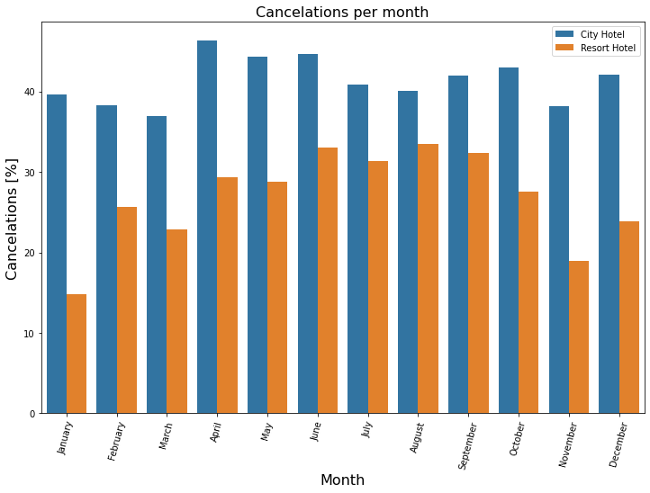
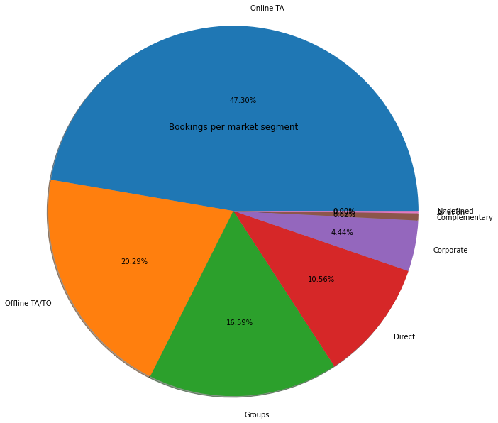

# Hotel Demand Summary

## 1. Where do the guests come from?
> - To answer this question the data was filtered by a registered country and a confirmed reservation
> - For presentation reasons up to 1000 guest per country were considered for the second pie plot and Map
> - After the analysis the mayor percentage (**28%**) of guests came from Portugal, which make sense as the data provides information from that specific country.
> - An interesting fact is that the second country with the highest percentage of guests (**13%**) is Great Britain despite the distance
> - Another interesting fact is that although Spain is very close, it is the country with the fourth percentage of guests (**9%**)

## 2. How much do guests pay for a room per night?
> - Most of the reservations **(76.79%)** came through Travel agents and Tour operators followed by Direct reservation to the Hotels.
> - On average the Cost of the Daily rate is higher when reservations area made using a Global Distribution System (GDS) and we have the lower rates for Corporate clientes. 
> -Travel Agencies have the second lowest rate.

##  3. How does the price per night vary over the year?
> - The summer months are the most expensive and the winter months are the most affordables

## 4. What is the average price by room type?
> - The room types represent the size and meal arrangements, even though they may not be the same for each Hotel and price varies depending demand. 
> - Rooms A and B had the lowest average price per room while rooms G and H had the highest average price.
> - This plot was filtered by Guest with the following criteria
>   - Who didn't cancel reservation
>   - That has a registered country
>   - More than 1000 per country

## 5. Which is the busiest month?
> - The busiest month for both Hotels is August 
> - We can consider November-January being low season where demand drops considerable to the rest of the year.
> - This plot was filtered by amount of reservations per Month
>   - Only not canceled reservations were included

## 6. How long do people stay at the hotels?
> - The data was filtered by **City Hotel**, **Resort Hotel**, and a confirmed reservation.
> - The analysis considered the sum of **week** and the **weekend** nights.
> - The analysis reveals that the average nights that a guest stays in a **City Hotel** is **2.92** nights and **52** is the maximum number of nights that a guest has stayed in the City Hotel.
> - In the other hand the average nights that a guest stays in a **Resort Hotel** is **4.142892** and **69** is the maximum number of nights a guest has stayed in the Resort Hotel
> - The **25.73 %** of guests stayed **3 nights** at a **City Hotel**, which is considered the biggest percentage
> - The **22.73 %** of guests stayed **1 night** at a **Resort Hotel**, which is considered the biggest percentage

## 7. How many bookings were canceled?
> - City Hotels has the highest cancelation rate
> - 37,04% of the total bookings were canceled

## 8. Which month have the highest number of cancelations?
> - August is the month with more cancelations **(11.85%)** and January is the month with less cancelations **(4.09%)**
> - For city hotels there is not much variance between months For the Resort hotel it is highest cancelations in the summer and lowest during the winter.

## 9. Bookings by market segment
> - Adults without children = **110,054** Adults with 1 child = **5446** Adults with 2 children = **3772** Adults with 3 children = **111**.
> - From the above table we can deduce that of the **119** thousand reservations, **110,054** were reservations for without children, most of them couples, followed by people traveling alone.
> - When there are more bookings with children, two adults travel, we can deduce that they are couples and their children

> - **47.30%** of bookings were made online, **20.29%** offline.
> - The rest were made by groups, corporations, directly at the hotel or by airline packages

## 10. Is there a correlation between Cancelations and Lead time?
> - After analyzing the data we decided to separate it in two groups, the first one takes into account the lead time for reservations under or equal to 50 days and the second one over 50 days.
> - For the lead time under or equal to 50 we found that the average of cancellation was **28.45%** and the r-value was **0.6482313461494058**
> - For the lead time over 50 we found that the average of cancellation was **56.28%** and the r-value was **0.3919649481639411**
> - We can observe that reservations with lead time over 50 days are twice as likely to be cancelled.

